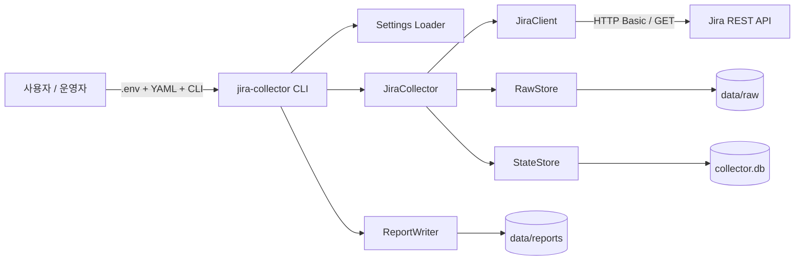
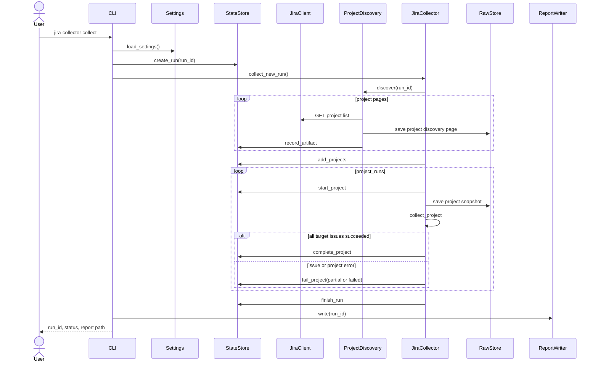
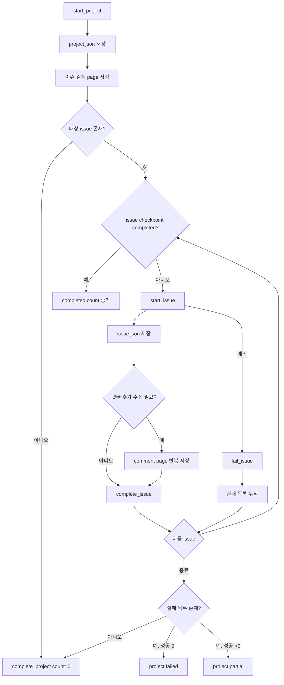
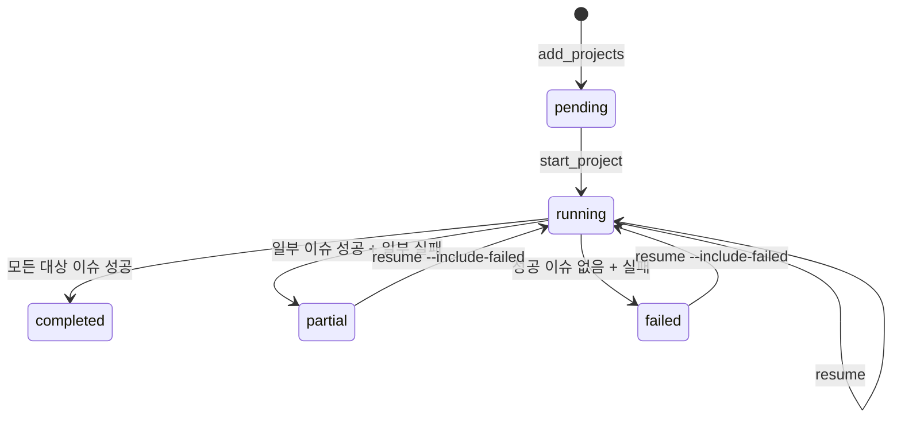
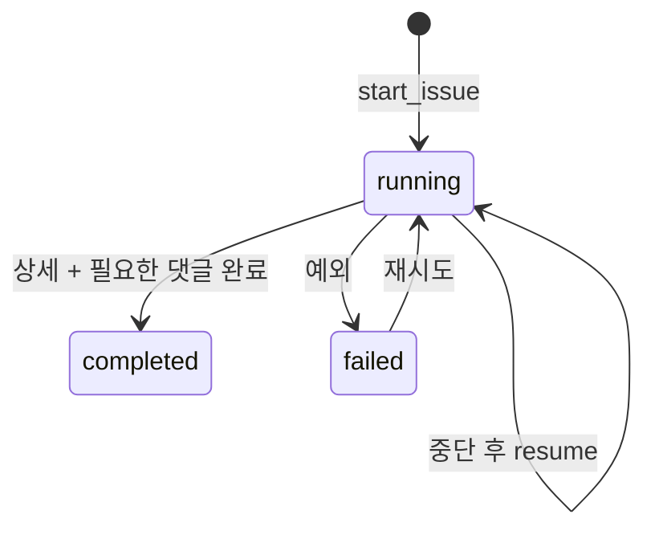

# Jira Raw Data Collector 상세 설계 명세

> 문서 상태: 구현 기준 명세
>
> 대상 버전: `jira-raw-data-collector 0.1.x`
>
> 독자: 후속 개발 Agent, 유지보수 개발자, 코드 리뷰어, 운영 담당자
>
> 문서 우선순위: 실제 코드와 테스트가 최종 사실이며, 코드 변경 시 이 문서도 같은 변경 단위에서 갱신해야 한다.

---

## 1. 문서 목적

이 문서는 다른 개발자나 Agent가 별도의 구두 설명 없이 현재 프로젝트를 이해하고, 기존 동작을 깨뜨리지 않으면서 후속 개발을 이어갈 수 있도록 작성한 설계 명세다.

문서가 제공해야 하는 정보는 다음과 같다.

1. 프로젝트의 목표와 명확한 범위
2. 변경해서는 안 되는 핵심 설계 결정
3. 모듈별 책임과 의존 관계
4. Jira REST API 호출 계약
5. 설정값의 출처와 우선순위
6. Raw JSON 및 SQLite 저장 구조
7. 수집, 실패 격리, checkpoint, 재개 동작
8. rate limit, timeout, retry 정책
9. CLI 명령과 종료 코드
10. 보안 원칙과 민감정보 처리
11. 현재 테스트가 검증하는 범위
12. 알려진 제한과 후속 개발 우선순위
13. 새로운 Agent가 작업을 시작할 때 따라야 할 절차

이 문서는 장래의 RAG, 임베딩, FAISS, MCP 구조를 설계하는 문서가 아니다. 현재 단계는 **Jira 원본 데이터 수집기**에 한정한다.

---

## 2. 프로젝트 목표

현재 인증 계정이 Jira REST API로 조회할 수 있는 모든 프로젝트를 발견하고, 파일럿에서는 각 프로젝트의 최근 수정 이슈를 최대 30개까지 수집해 JSON snapshot으로 보존한다.

핵심 성공 문장은 다음과 같다.

> Jira URL, 사용자명, 비밀번호를 사용자가 별도 입력하면, 수집기는 분당 최대 20회의 보수적인 호출 정책을 지키면서 접근 가능한 프로젝트를 발견하고 프로젝트별 최근 이슈를 저장하며, 부분 실패와 프로세스 중단 이후에도 재개할 수 있어야 한다.

### 2.1 현재 구현이 보장하려는 품질

- 읽기 전용
- 프로젝트 단위 실패 격리
- 이슈 단위 checkpoint
- 실행별 snapshot 보존
- 파일의 원자적 교체
- SHA-256 무결성 확인
- 민감정보 비노출
- Jira API 경로 설정 분리
- 테스트 가능한 순수 Python 구조

### 2.2 품질 우선순위

1. Jira에 쓰기 요청을 보내지 않는 것
2. 인증정보를 유출하지 않는 것
3. 수집한 파일이 중간 상태로 깨지지 않는 것
4. 일부 실패가 전체 수집 결과를 없애지 않는 것
5. 재실행과 재개가 가능한 것
6. 호출 제한을 지키는 것
7. 수집 속도

속도는 마지막 우선순위다. 파일럿에서 병렬화를 추가해 20회/분 정책을 우회해서는 안 된다.

---

## 3. 범위

### 3.1 포함 범위

- `.env`를 통한 Jira URL, 사용자명, 비밀번호 입력
- YAML을 통한 API 경로와 수집 정책 설정
- HTTP Basic 인증을 사용하는 Jira GET 요청
- `/myself` 계열 연결 확인
- 접근 가능한 프로젝트 전체 발견
- 배열형 프로젝트 응답 처리
- 페이지 객체형 프로젝트 응답 처리
- 프로젝트별 JQL 검색
- 최근 수정 이슈 최대 N개 수집
- 이슈 상세 JSON 수집
- 상세 응답에 포함되지 않은 댓글 페이지 추가 수집
- 실행별 Raw JSON snapshot
- SQLite 실행 상태와 checkpoint
- 프로젝트 단위 부분 실패 격리
- 중단된 실행의 재개
- 실패 프로젝트 선택 재시도
- 저장 파일 SHA-256 검증
- 실행 요약 JSON 보고서
- GitHub Actions에서 pytest 실행

### 3.2 명시적 제외 범위

- Jira 이슈 생성, 수정, 삭제
- 댓글 작성 또는 첨부파일 업로드
- 첨부파일 바이너리 다운로드
- 첨부파일 본문 분석
- Jira 내부 데이터베이스 직접 접근
- 임베딩 생성
- FAISS 또는 벡터 DB
- RAG 검색
- MCP 서버
- Agent LLM
- 온톨로지 및 지식 그래프
- 사용자별 Jira 권한 재현
- 자동 주기 스케줄러
- 다중 프로세스 수집
- 웹 UI 및 운영 대시보드
- 실행 간 증분 동기화

### 3.3 용어 정의

| 용어 | 의미 |
|---|---|
| run | 한 번의 프로젝트 발견 및 수집 실행 단위 |
| run_id | UTC 시각으로 생성되는 실행 식별자 |
| project run | 하나의 run 안에서 특정 프로젝트를 수집하는 하위 실행 |
| artifact | 디스크에 저장되고 SQLite에 경로와 hash가 기록된 JSON 파일 |
| Raw JSON | Jira가 반환한 JSON payload를 Python 객체로 파싱한 뒤 UTF-8 pretty JSON으로 다시 직렬화한 파일 |
| checkpoint | 프로젝트 또는 이슈의 수집 진행 상태를 SQLite에 기록한 값 |
| snapshot | 특정 run 시점의 수집 결과를 이전 run과 분리해 보존한 파일 집합 |
| resume | 기존 run_id의 미완료 프로젝트를 다시 처리하는 동작 |
| partial | 일부 이슈 또는 프로젝트는 성공했지만 전체가 성공하지 않은 상태 |

**주의:** 현재 `Raw JSON`은 HTTP wire byte를 그대로 보존한 파일이 아니다. 응답 JSON을 파싱한 후 `json.dumps(..., ensure_ascii=False, indent=2)`로 재직렬화한 결과다. HTTP status, 요청 파라미터, 응답 헤더 전체도 artifact 파일에 포함하지 않는다.

---

## 4. 확정된 설계 결정과 불변 조건

다음 조건은 명시적인 설계 변경 합의 없이 바꾸지 않는다.

### 4.1 인증정보 분리

사용자별 민감정보는 다음 세 환경 변수로만 받는다.

```dotenv
JIRA_BASE_URL=
JIRA_USERNAME=
JIRA_PASSWORD=
```

실제 값은 저장소에 commit하지 않는다.

### 4.2 Jira API 호출 제한

- 최대 설정값: 20 requests/minute
- 기본값: 20 requests/minute
- 구현 해석: 요청 시작 시각 사이 최소 3초
- 동시 요청 수: 1
- 재시도 요청도 limiter를 통과

### 4.3 파일럿 수집 범위

- 프로젝트: 인증 계정이 조회 가능한 모든 프로젝트
- 이슈: 프로젝트별 `updated DESC` 최대 30개
- `30`은 전체 합계가 아니라 프로젝트별 상한
- CLI로 양의 정수를 전달하면 실행 단위에서 30보다 큰 값도 현재 코드상 허용됨

### 4.4 원본 우선

검색, 정규화, RAG를 추가하기 전에 Jira JSON snapshot이 먼저 보존되어야 한다.

### 4.5 실패 격리

하나의 프로젝트가 실패해도 다음 프로젝트를 계속 처리한다.

### 4.6 이슈 완료 checkpoint 경계

이슈 상세 JSON만 저장되었다고 이슈를 `completed`로 표시하지 않는다. 댓글 추가 수집이 필요하면 모든 댓글 페이지 저장이 끝난 뒤에만 `completed`로 전환한다.

### 4.7 읽기 전용

현재 JiraClient는 `GET`만 제공한다. POST, PUT, PATCH, DELETE 메서드를 추가하려면 별도 설계 검토가 필요하다.

---

## 5. 시스템 컨텍스트



### 5.1 신뢰 경계

- Jira 서버는 외부 시스템이지만 사내 신뢰 네트워크에 있다고 가정한다.
- `.env`는 민감정보 영역이다.
- `data/raw`, `data/state`, `data/reports`는 Jira 업무정보를 포함할 수 있는 보호 대상이다.
- Git 저장소에는 코드, 예제 설정, 문서만 포함한다.
- 로그에는 비밀번호, Authorization, Cookie, 전체 응답 body를 남기지 않는다.

---

## 6. 저장소 구조

```text
jira_database/
├─ .env.example
├─ .github/
│  └─ workflows/
│     └─ ci.yml
├─ .gitignore
├─ README.md
├─ pyproject.toml
├─ config/
│  └─ settings.yaml
├─ docs/
│  └─ DESIGN.md
├─ src/
│  └─ jira_collector/
│     ├─ __init__.py
│     ├─ __main__.py
│     ├─ cli.py
│     ├─ collector.py
│     ├─ jira_client.py
│     ├─ project_discovery.py
│     ├─ rate_limiter.py
│     ├─ raw_store.py
│     ├─ report.py
│     ├─ settings.py
│     └─ state_store.py
└─ tests/
   ├─ conftest.py
   ├─ test_collector.py
   ├─ test_project_discovery.py
   ├─ test_rate_limiter.py
   ├─ test_raw_store.py
   ├─ test_settings.py
   └─ test_state_store.py
```

---

## 7. 모듈별 책임

### 7.1 `settings.py`

책임:

- `.env` 로드
- 기본 YAML 로드
- 선택적 local YAML deep merge
- 필수 환경 변수 검증
- URL 형식 검증
- 설정값 타입 변환
- dataclass 기반 불변 설정 객체 생성

주요 타입:

- `AppSettings`
- `JiraSettings`
- `PaginationSettings`
- `CollectionSettings`
- `RateLimitSettings`
- `TimeoutSettings`
- `RetrySettings`
- `StorageSettings`
- `LoggingSettings`

금지 책임:

- Jira API 호출
- 디렉터리 생성
- SQLite 초기화
- 비밀번호 로그 출력

### 7.2 `rate_limiter.py`

책임:

- 요청 시작 시각 사이의 최소 간격 보장
- lock을 통한 동일 프로세스 내 우발적 병렬 호출 방지

현재 알고리즘:

```text
interval = 60 / requests_per_minute
첫 요청은 즉시 통과
다음 요청은 last_started_at 이후 interval이 지나지 않았으면 남은 시간 sleep
현재 시각을 새 last_started_at으로 기록
```

이 limiter는 **프로세스 로컬**이다. 여러 프로세스가 동시에 실행되면 각 프로세스가 독립적으로 20회/분을 사용할 수 있다.

### 7.3 `jira_client.py`

책임:

- `requests.Session` 생성
- HTTP Basic 인증 설정
- 공통 Accept 및 User-Agent 헤더 설정
- API URL 조합
- GET 요청
- timeout 적용
- rate limiter 적용
- 연결 오류와 HTTP 상태별 재시도 또는 예외 변환
- JSON 파싱

반환 타입:

```python
ApiResult(
    payload=<parsed JSON>,
    status_code=<HTTP status>,
    url=<final request URL>,
    headers=<response headers>,
)
```

현재 저장 계층은 `ApiResult.payload`만 artifact로 저장한다.

### 7.4 `project_discovery.py`

책임:

- 프로젝트 API 페이지 반복
- 각 응답 페이지를 artifact로 저장
- 배열형 및 페이지형 응답 해석
- key 기준 중복 제거
- key 순 정렬된 `ProjectInfo` 반환

지원 응답 형태:

1. 최상위 배열
2. 최상위 객체의 `values` 배열
3. 최상위 객체의 `projects` 배열

### 7.5 `collector.py`

책임:

- 새 run 생성
- 프로젝트 발견
- project filter 적용
- 프로젝트 상태 등록
- 프로젝트별 수집 반복
- 프로젝트 실패 격리
- 이슈 검색
- 이슈 상세 수집
- 누락 댓글 페이지 수집
- 이슈 checkpoint 전환
- run 완료 상태 산출

`JiraCollector`는 orchestration 계층이다. 네트워크 세부 정책은 `JiraClient`, 파일 저장은 `RawStore`, 상태 관리는 `StateStore`에 위임한다.

### 7.6 `raw_store.py`

책임:

- path component sanitization
- raw root 밖으로 나가는 경로 차단
- JSON UTF-8 직렬화
- SHA-256 계산
- 임시 파일 기록
- `flush` 및 `fsync`
- `os.replace`를 통한 atomic 교체
- 파일 hash 검증

### 7.7 `state_store.py`

책임:

- SQLite 스키마 생성
- run 상태 관리
- project run 상태 관리
- issue checkpoint 관리
- artifact metadata 관리
- resume 대상 조회
- 최종 run 상태 계산

현재 각 메서드는 독립 SQLite connection과 transaction을 사용한다.

### 7.8 `report.py`

책임:

- run summary 조회
- 프로젝트별 상태 조회
- artifact type별 개수 집계
- JSON 보고서 atomic 저장

보고서 자체는 `artifacts` 테이블에 등록하지 않으며 SHA-256 검증 대상도 아니다.

### 7.9 `cli.py`

책임:

- CLI parser 정의
- 설정 로드
- logging 초기화
- 구성요소 생성
- 명령별 서비스 호출
- 사용자용 출력
- 알려진 오류를 종료 코드로 변환

---

## 8. 설정 명세

### 8.1 설정 파일

기본 파일:

```text
config/settings.yaml
```

선택적 local override:

```text
config/settings.local.yaml
```

민감정보:

```text
.env
```

### 8.2 설정 우선순위

낮은 우선순위에서 높은 우선순위 순서:

1. 코드 내 fallback 기본값
2. `config/settings.yaml`
3. `config/settings.local.yaml` deep merge
4. `.env`에서 읽은 환경 변수
5. 이미 프로세스에 존재하는 OS 환경 변수
6. 일부 CLI 실행 옵션

`python-dotenv`는 `override=False`로 호출된다. 따라서 OS 환경 변수가 이미 있으면 `.env`가 덮어쓰지 않는다.

CLI가 직접 덮어쓸 수 있는 값은 현재 다음뿐이다.

- `--config`
- `--local-config`
- `--dotenv`
- `collect --project`
- `collect --issues-per-project`
- `resume --include-failed`

### 8.3 필수 환경 변수

| 변수 | 필수 | 의미 | 검증 |
|---|---:|---|---|
| `JIRA_BASE_URL` | 예 | Jira base URL | `http` 또는 `https`, netloc 필수 |
| `JIRA_USERNAME` | 예 | Basic 인증 사용자명 | 빈 문자열 금지 |
| `JIRA_PASSWORD` | 예 | Basic 인증 비밀번호 | 빈 문자열 금지 |

코드는 `http`도 허용하지만 운영 환경에서는 HTTPS만 사용해야 한다.

### 8.4 YAML 항목

| 경로 | 기본값 | 제약 | 설명 |
|---|---:|---|---|
| `jira.api_base_path` | `/rest/api/2` | 문자열 | Jira API 공통 prefix |
| `jira.myself_path` | `/myself` | 문자열 | 연결 확인 경로 |
| `jira.project_list_path` | `/project` | 문자열 | 프로젝트 목록 경로 |
| `jira.issue_search_path` | `/search` | 문자열 | 이슈 검색 경로 |
| `jira.issue_path` | `/issue/{issue_key}` | placeholder 필요 | 이슈 상세 경로 |
| `jira.comment_path` | `/issue/{issue_key}/comment` | placeholder 필요 | 댓글 경로 |
| `jira.pagination.project_page_size` | 50 | 1 이상 | 프로젝트 페이지 크기 |
| `jira.pagination.search_page_size` | 30 | 1 이상 | 이슈 검색 페이지 크기 |
| `jira.pagination.comment_page_size` | 100 | 1 이상 | 댓글 페이지 크기 |
| `jira.collection.project_scope` | `all_accessible` | 현재 동작 분기 없음 | 설계 의도 기록용 |
| `jira.collection.issues_per_project` | 30 | 1 이상 | 프로젝트별 이슈 상한 |
| `jira.collection.issue_order` | `updated_desc` | 현재 동작 분기 없음 | 현재 JQL은 항상 updated DESC |
| `jira.collection.collect_comments` | true | boolean | 댓글 추가 수집 여부 |
| `jira.collection.download_attachments` | false | 현재 미구현 | false 유지 |
| `jira.rate_limit.requests_per_minute` | 20 | 1~20 | 프로세스별 요청 속도 |
| `jira.rate_limit.max_concurrency` | 1 | 정확히 1 | 파일럿 단일 worker 강제 |
| `jira.timeout.connect_seconds` | 10 | 양수 권장 | requests connect timeout |
| `jira.timeout.read_seconds` | 60 | 양수 권장 | requests read timeout |
| `jira.retry.max_attempts` | 3 | 1 이상 | 최초 요청 포함 최대 시도 수 |
| `jira.retry.backoff_initial_seconds` | 3 | 음수 금지 권장 | 지수 backoff 시작값 |
| `jira.retry.backoff_max_seconds` | 60 | 시작값 이상 권장 | 지수 backoff 상한 |
| `storage.data_root` | `./data` | Path | 현재 작업 디렉터리 기준 |
| `storage.raw_directory` | `raw` | 문자열 | raw 하위 디렉터리 |
| `storage.state_directory` | `state` | 문자열 | SQLite 하위 디렉터리 |
| `storage.report_directory` | `reports` | 문자열 | 보고서 하위 디렉터리 |
| `logging.level` | `INFO` | logging level | CLI logging level |
| `logging.log_response_body` | false | 현재 미사용 | 향후 사용 시 보안 검토 필요 |

`project_scope`, `issue_order`, `download_attachments`, `log_response_body`는 설정 객체에는 존재하지만 현재 코드의 실제 분기에는 사용되지 않거나 제한적으로만 사용된다. 다음 Agent는 이 값을 이미 구현된 기능으로 오해하면 안 된다.

### 8.5 API URL 조합

```text
{base_url.rstrip('/')}/{api_base_path.strip('/')}/{path.lstrip('/')}
```

예:

```text
JIRA_BASE_URL=https://jira.example.com
api_base_path=/rest/api/2
path=/myself

결과: https://jira.example.com/rest/api/2/myself
```

---

## 9. CLI 계약

### 9.1 공통 형식

```bash
jira-collector [공통 옵션] <command> [command 옵션]
```

공통 옵션:

```text
--config
--local-config
--dotenv
```

### 9.2 `check-connection`

```bash
jira-collector check-connection
```

동작:

1. 설정 로드
2. `GET myself_path`
3. 응답의 `displayName`, `name`, `key` 순으로 사용자 표시값 선택
4. HTTP status와 사용자 표시

파일과 DB는 생성하지 않는다.

### 9.3 `discover-projects`

```bash
jira-collector discover-projects
```

동작:

1. `discover-<UTC timestamp>` run 생성
2. 프로젝트 목록 전체 페이지 수집
3. raw project discovery page 저장
4. 콘솔에 key와 name 출력
5. run 종료 및 report 저장

현재 구현 제한: 발견된 프로젝트를 `project_runs`에 추가하지 않으므로 discover 전용 report의 `project_count`와 `projects` 목록은 실제 발견 결과를 반영하지 않는다. 콘솔 출력과 raw page가 현재 사실 기준이다.

### 9.4 `collect`

```bash
jira-collector collect
jira-collector collect --project ABC
jira-collector collect --issues-per-project 10
```

- `--project`: 정확히 일치하는 프로젝트 key 한 개만 수집
- `--issues-per-project`: YAML 값을 해당 실행에서 대체
- 프로젝트 key 비교는 현재 대소문자를 구분한다.

### 9.5 `resume`

```bash
jira-collector resume --run-id <RUN_ID>
jira-collector resume --run-id <RUN_ID> --include-failed
```

기본 resume 대상:

- `pending`
- `running`

`--include-failed` 추가 대상:

- `failed`
- `partial`

`completed` 프로젝트는 재수집하지 않는다.

### 9.6 `verify`

```bash
jira-collector verify --run-id <RUN_ID>
```

SQLite `artifacts` 레코드에 등록된 각 파일을 읽어 SHA-256을 다시 계산한다.

검증하지 않는 것:

- SQLite 자체 무결성
- DB에 등록되지 않은 추가 파일
- report JSON
- Jira 서버의 현재 데이터와 snapshot의 동일성
- HTTP 원본 byte 동일성

### 9.7 종료 코드

| 코드 | 의미 |
|---:|---|
| 0 | 명령 성공 또는 collection status가 completed |
| 1 | 설정 오류, JiraClientError, KeyError, ValueError |
| 2 | collect 또는 resume가 partial로 종료 |
| 3 | verify에서 hash 불일치 또는 파일 누락 |

예상하지 못한 예외는 현재 `main()`의 알려진 예외 목록에 포함되지 않아 traceback과 비표준 종료로 이어질 수 있다.

---

## 10. Jira REST API 계약

사내 Jira의 정확한 배포 유형과 버전은 코드에 고정하지 않는다. 모든 경로는 YAML로 변경 가능해야 한다.

### 10.1 공통 요청

- Method: `GET`
- Auth: `requests.Session.auth = (username, password)`
- Header: `Accept: application/json`
- Header: `User-Agent: jira-raw-data-collector/0.1.0`
- Timeout: `(connect_seconds, read_seconds)`
- Response: 2xx JSON 기대

### 10.2 연결 확인

```http
GET {api_base_path}{myself_path}
```

기본 경로:

```text
/rest/api/2/myself
```

### 10.3 프로젝트 목록

```http
GET {api_base_path}{project_list_path}
```

Query:

```text
startAt=<offset>
maxResults=<project_page_size>
```

허용 응답 예시 1:

```json
[
  {"key": "ABC", "name": "Alpha"}
]
```

허용 응답 예시 2:

```json
{
  "startAt": 0,
  "total": 1,
  "isLast": true,
  "values": [
    {"key": "ABC", "name": "Alpha"}
  ]
}
```

허용 응답 예시 3:

```json
{
  "projects": [
    {"key": "ABC", "name": "Alpha"}
  ]
}
```

프로젝트 key가 없는 항목은 무시한다. 같은 key가 여러 번 나오면 마지막 항목이 최종 `ProjectInfo`가 된다.

### 10.4 이슈 검색

```http
GET {api_base_path}{issue_search_path}
```

Query:

```text
jql=project = "ABC" ORDER BY updated DESC
startAt=<offset>
maxResults=<remaining과 search_page_size 중 작은 값>
fields=*all
expand=names,schema
```

기대 응답:

```json
{
  "startAt": 0,
  "total": 1,
  "issues": [
    {"key": "ABC-1"}
  ]
}
```

- 최상위는 객체여야 한다.
- `issues`는 배열이어야 한다.
- key가 없는 항목은 오류 메시지 목록에 추가되고 이슈 수집은 수행하지 않는다.
- 같은 issue key는 한 search 실행 내에서 중복 제거한다.

### 10.5 이슈 상세

```http
GET {api_base_path}{issue_path.format(issue_key=...)}
```

Query:

```text
fields=*all
expand=names,schema,renderedFields
```

기본 저장 위치:

```text
data/raw/runs/<run_id>/projects/<project_key>/issues/<issue_key>/issue.json
```

`fields.updated`가 존재하면 `artifacts.jira_updated_at`에 문자열로 기록한다.

### 10.6 댓글 추가 페이지

```http
GET {api_base_path}{comment_path.format(issue_key=...)}
```

Query:

```text
startAt=<offset>
maxResults=<comment_page_size>
```

이슈 상세의 embedded comment가 다음 조건을 만족하면 댓글 API를 호출하지 않는다.

```text
embedded startAt == 0
AND embedded comment count >= embedded total
```

일부만 포함된 경우:

```text
embedded startAt == 0
→ startAt = embedded comment count부터 추가 수집
```

embedded startAt이 0이 아니면 누락 위험을 피하기 위해 댓글 API를 `startAt=0`부터 다시 수집한다.

기대 댓글 응답:

```json
{
  "startAt": 1,
  "total": 3,
  "comments": [
    {"id": "2", "body": "..."}
  ]
}
```

현재 구현은 embedded comment 객체에 `total`이 없을 때 정확한 누락 판정을 보장하지 않는다. Jira fixture를 추가해 실제 사내 응답 구조를 먼저 고정해야 한다.

---

## 11. 새 수집 실행 흐름



### 11.1 run_id 생성

```text
UTC datetime format: %Y%m%dT%H%M%SZ
예: 20260803T112700Z
```

현재 초 단위이므로 같은 프로세스 또는 여러 프로세스가 같은 초에 새 run을 만들면 primary key 충돌 가능성이 있다.

### 11.2 project filter

프로젝트 전체 발견과 raw page 저장 후, 메모리의 프로젝트 목록을 exact key로 필터링한다.

필터 key가 없으면:

1. run을 finish 처리
2. `KeyError` 발생
3. report는 현재 작성되지 않음

---

## 12. 프로젝트 수집 흐름



### 12.1 부분 실패 집계

- 각 이슈 실패는 즉시 project 전체 loop를 중단하지 않는다.
- 최대 10개의 실패 메시지를 project error에 연결한다.
- 10개 초과 시 남은 개수만 요약한다.
- project error message와 issue error message는 SQLite에 최대 2000자까지 저장한다.

### 12.2 프로젝트 상태 결정

| 조건 | 상태 |
|---|---|
| 모든 대상 이슈 성공 | `completed` |
| 하나 이상 성공하고 하나 이상 실패 | `partial` |
| 성공 이슈가 없고 실패 발생 | `failed` |
| 실행 전 | `pending` |
| 처리 중 | `running` |

이슈가 0개 검색된 프로젝트는 오류가 없으면 `completed`, `collected_count=0`이다.

---

## 13. Resume 의미론

### 13.1 기본 resume

`pending`, `running` 프로젝트만 다시 처리한다.

### 13.2 실패 포함 resume

`--include-failed`를 사용하면 `failed`, `partial`도 다시 처리한다.

### 13.3 이슈 checkpoint 처리

프로젝트를 재처리할 때 이슈 검색을 다시 실행한다. 검색 결과의 각 이슈에 대해:

- checkpoint가 `completed`이면 네트워크 상세 호출을 건너뜀
- `running`, `failed`, 미존재이면 상세와 댓글을 다시 수집

### 13.4 현재 resume의 중요한 제한

현재 run이 처음 선택한 issue key 목록을 별도 테이블에 고정하지 않는다. resume 시 `updated DESC` 검색을 다시 실행하므로 시간이 지난 뒤 top N 목록이 바뀔 수 있다.

예:

1. 최초 run에서 `ABC-1`이 대상이었으나 실패
2. 이후 더 최근 이슈가 많이 생성됨
3. resume의 top 30에서 `ABC-1`이 밀려남
4. `ABC-1`은 실패 checkpoint가 남아도 재시도되지 않음

후속 구현에서 재현 가능한 resume가 필요하면 `run_issue_targets` 테이블을 추가해 최초 검색 결과를 고정해야 한다.

---

## 14. Rate limit 및 Retry 명세

### 14.1 Rate limit

기본 설정:

```text
requests_per_minute = 20
interval = 3.0 seconds
max_concurrency = 1
```

모든 `JiraClient.get_json()` 시도는 네트워크 요청 직전에 `limiter.wait()`를 호출한다. 재시도도 새로운 시도로서 limiter를 다시 통과한다.

### 14.2 범위

현재 limiter가 보장하는 범위:

- 하나의 Python 프로세스
- 하나의 JiraClient 인스턴스
- 요청 시작 간 최소 간격

보장하지 않는 범위:

- 여러 프로세스 합산 20회/분
- 여러 호스트 합산 20회/분
- 외부 프로그램과 공유하는 Jira 계정 전체 quota
- 엄밀한 distributed sliding-window quota

### 14.3 Retry 분류

| 상황 | 재시도 | 처리 |
|---|---:|---|
| `requests.RequestException` | 예 | 지수 backoff 후 재시도 |
| HTTP 401 | 아니오 | `JiraAuthenticationError` |
| HTTP 403 | 아니오 | `JiraPermissionError` |
| HTTP 404 | 아니오 | `JiraNotFoundError` |
| HTTP 429 | 예 | `max(3초, Retry-After)` 후 재시도 |
| HTTP 5xx | 예 | 지수 backoff 후 재시도 |
| 기타 non-2xx | 아니오 | `JiraResponseError` |
| 2xx이지만 JSON 아님 | 아니오 | `JiraResponseError` |

### 14.4 Backoff

```text
delay = min(
    backoff_initial_seconds * 2 ** (attempt - 1),
    backoff_max_seconds
)
```

기본 `max_attempts=3`은 최초 요청을 포함한다.

### 14.5 Retry-After

현재 `Retry-After`는 숫자형 seconds만 파싱한다. HTTP-date 형식은 0초로 간주되어 limiter interval만 적용된다.

---

## 15. Raw 저장 명세

### 15.1 디렉터리 구조

```text
data/
├─ raw/
│  └─ runs/
│     └─ <run_id>/
│        ├─ project_discovery/
│        │  └─ page_0001.json
│        └─ projects/
│           └─ <project_key>/
│              ├─ project.json
│              ├─ issue_search/
│              │  └─ page_0001.json
│              └─ issues/
│                 └─ <issue_key>/
│                    ├─ issue.json
│                    └─ comments/
│                       └─ page_0001.json
├─ state/
│  └─ collector.db
└─ reports/
   └─ <run_id>.json
```

### 15.2 artifact type

| artifact_type | 의미 |
|---|---|
| `project_discovery_page` | 프로젝트 목록 API의 한 페이지 |
| `project` | 발견 응답에 포함된 프로젝트 객체 한 개 |
| `issue_search_page` | 프로젝트 JQL 검색 응답 한 페이지 |
| `issue` | 이슈 상세 응답 |
| `comment_page` | 이슈 상세에 누락된 댓글 API 응답 페이지 |

### 15.3 JSON 직렬화

```python
json.dumps(
    payload,
    ensure_ascii=False,
    indent=2,
    sort_keys=False,
).encode("utf-8")
```

SHA-256은 이 직렬화 결과 byte에 대해 계산한다.

### 15.4 atomic 저장 순서

1. target과 같은 디렉터리에 임시 파일 생성
2. encoded JSON 전체 기록
3. `flush()`
4. `os.fsync()`
5. `os.replace(temp, target)`
6. SQLite artifact 기록

프로세스가 5번 이전에 중단되면 기존 target은 유지된다. 5번 이후 6번 이전에 중단되면 파일은 존재하지만 DB artifact가 없을 수 있다.

### 15.5 경로 안전성

`safe_component()`는 다음 문자 외의 값을 `_`로 바꾼다.

```text
A-Z a-z 0-9 . _ -
```

앞뒤 `.`과 `_`는 제거한다. 정리 후 빈 값이면 오류다.

`RawStore`는 resolve된 target이 raw root 밖으로 나가면 저장을 거부한다.

### 15.6 snapshot 특성

run별 디렉터리를 사용하므로 같은 이슈를 다음 run에서 다시 수집해도 이전 run의 파일은 변경하지 않는다.

현재는 실행 간 deduplication을 하지 않으므로 저장 공간이 반복 사용된다. 이는 원본 snapshot 우선 결정에 따른 의도된 trade-off다.

---

## 16. SQLite 상태 모델

### 16.1 데이터베이스 파일

```text
data/state/collector.db
```

초기화 시 WAL mode를 요청한다.

### 16.2 `collection_runs`

| 컬럼 | 타입 | 의미 |
|---|---|---|
| `run_id` | TEXT PK | 실행 식별자 |
| `started_at` | TEXT | UTC ISO 시작 시각 |
| `finished_at` | TEXT nullable | 종료 시각 |
| `status` | TEXT | running, completed, partial |
| `issues_per_project` | INTEGER | 실행 시 프로젝트별 목표 수 |
| `project_count` | INTEGER | 등록된 project run 수 |
| `success_count` | INTEGER | completed 프로젝트 수 |
| `failure_count` | INTEGER | failed 또는 partial 프로젝트 수 |

### 16.3 `project_runs`

| 컬럼 | 타입 | 의미 |
|---|---|---|
| `run_id` | TEXT PK 일부 | 상위 실행 |
| `project_key` | TEXT PK 일부 | 프로젝트 key |
| `project_name` | TEXT | 발견 시 이름 |
| `status` | TEXT | pending, running, completed, partial, failed |
| `requested_count` | INTEGER | 이슈 상한 |
| `collected_count` | INTEGER | 성공 완료 이슈 수 |
| `started_at` | TEXT nullable | 프로젝트 시작 시각 |
| `finished_at` | TEXT nullable | 프로젝트 종료 시각 |
| `error_message` | TEXT nullable | 최대 2000자 오류 |

### 16.4 `artifacts`

| 컬럼 | 타입 | 의미 |
|---|---|---|
| `artifact_id` | INTEGER PK | 자동 증가 ID |
| `run_id` | TEXT | 상위 실행 |
| `project_key` | TEXT nullable | 프로젝트 |
| `issue_key` | TEXT nullable | 이슈 |
| `artifact_type` | TEXT | artifact 분류 |
| `relative_path` | TEXT | data root 기준 경로 |
| `content_hash` | TEXT | SHA-256 hex |
| `size_bytes` | INTEGER | 직렬화 byte 크기 |
| `collected_at` | TEXT | DB 기록 시각 |
| `jira_updated_at` | TEXT nullable | 이슈 fields.updated |

Unique key:

```text
(run_id, artifact_type, relative_path)
```

같은 key를 다시 기록하면 hash, size, collected_at, jira_updated_at을 update한다.

### 16.5 `issue_checkpoints`

| 컬럼 | 타입 | 의미 |
|---|---|---|
| `run_id` | TEXT PK 일부 | 실행 |
| `project_key` | TEXT PK 일부 | 프로젝트 |
| `issue_key` | TEXT PK 일부 | 이슈 |
| `status` | TEXT | running, completed, failed |
| `updated_at` | TEXT | checkpoint 변경 시각 |
| `error_message` | TEXT nullable | 최대 2000자 오류 |

### 16.6 상태 전이



이슈 checkpoint:



### 16.7 transaction 경계

`StateStore.connect()` 한 번이 하나의 transaction 경계다.

- 정상 종료: commit
- 예외: rollback
- 항상 connection close

현재 `PRAGMA foreign_keys=ON`은 `_initialize()`에서 사용한 connection에만 적용된다. SQLite foreign key pragma는 connection별 설정이므로 후속 connection에서 FK 강제가 활성화되지 않을 가능성이 있다. 다음 Agent가 우선 수정해야 할 데이터 무결성 이슈다.

---

## 17. Run 최종 상태 계산

`finish_run()`은 `project_runs`를 조회해 다음처럼 계산한다.

```text
success_count = status == completed
failure_count = status in {failed, partial}
unfinished_count = total - success_count - failure_count

failure_count > 0 또는 unfinished_count > 0
→ run status = partial
그 외
→ run status = completed
```

프로젝트가 하나도 등록되지 않은 run은 현재 `completed`가 된다.

---

## 18. 보고서 명세

경로:

```text
data/reports/<run_id>.json
```

구조:

```json
{
  "run": {
    "run_id": "...",
    "status": "completed",
    "project_count": 1,
    "success_count": 1,
    "failure_count": 0
  },
  "projects": [
    {
      "project_key": "ABC",
      "status": "completed",
      "requested_count": 30,
      "collected_count": 30
    }
  ],
  "artifacts": {
    "total": 63,
    "by_type": {
      "project_discovery_page": 1,
      "project": 1,
      "issue_search_page": 1,
      "issue": 30,
      "comment_page": 30
    }
  }
}
```

보고서는 임시 파일, fsync, atomic replace로 기록한다.

현재 보고서에는 개별 artifact 목록, issue checkpoint 목록, API 호출 수, 수행 시간, 재시도 횟수가 포함되지 않는다.

---

## 19. 오류 처리 및 실패 격리

### 19.1 전역 중단 오류

다음 오류는 일반적으로 명령 전체를 중단한다.

- 설정 파일 없음 또는 YAML 오류
- 필수 환경 변수 누락
- 잘못된 base URL
- 연결 확인의 401/403/404
- 프로젝트 발견 단계 오류
- run_id 충돌
- SQLite 초기화 실패
- data root 생성 실패

### 19.2 프로젝트 경계에서 격리되는 오류

`_collect_project_list()`는 프로젝트 처리 전체를 `try/except Exception`으로 감싼다.

- 프로젝트 snapshot 저장 실패
- 이슈 검색 실패
- 이슈 상세 실패 누적
- 댓글 수집 실패 누적
- DB project 완료 처리 실패

오류를 기록한 뒤 다음 프로젝트로 진행한다.

### 19.3 이슈 경계에서 격리되는 오류

`collect_project()`는 각 이슈 상세 및 댓글 처리를 개별 `try/except`로 감싼다. 실패 이슈는 checkpoint `failed`, 성공 이슈는 `completed`가 된다.

### 19.4 민감정보 처리

- 비밀번호는 예외 메시지에 넣지 않는다.
- Authorization/Cookie header를 로그로 출력하지 않는다.
- 응답 body를 기본 로그로 출력하지 않는다.
- 403/404 오류에는 최종 URL이 포함될 수 있다. 현재 URL query에는 인증정보를 사용하지 않는다.

---

## 20. 보안 요구사항

### 20.1 필수

- 가능하면 Jira 읽기 전용 계정 사용
- HTTPS endpoint 사용
- `.env` 파일 권한 제한
- `.env` Git 제외 유지
- `data/` Git 제외 유지
- 로그 전달 전 민감정보 검토
- 저장 디렉터리 접근 권한 제한
- 백업 및 삭제 정책을 조직 보안 기준에 맞춤

### 20.2 금지

- 소스코드에 ID/Password 하드코딩
- `settings.yaml`에 실제 비밀번호 저장
- URL query string에 비밀번호 저장
- Jira 응답 전체를 INFO 로그로 출력
- public GitHub에 data 파일 업로드
- 읽기 전용 검토 없이 쓰기 메서드 추가

### 20.3 현재 미지원 보안 기능

- Secret manager 직접 연동
- 사용자별 검색 권한 필터
- 저장 파일 암호화
- SQLite 암호화
- audit log 서명
- mTLS
- custom CA 설정 UI
- credential rotation 자동화

---

## 21. 테스트 전략

### 21.1 원칙

- 단위 테스트는 실제 Jira에 연결하지 않는다.
- fake session/client와 임시 디렉터리를 사용한다.
- 시간 기반 테스트는 fake clock과 fake sleeper를 사용한다.
- 파일 테스트는 실제 임시 파일 시스템에서 수행한다.
- SQLite 테스트는 임시 DB에서 수행한다.

### 21.2 현재 검증 항목

`test_settings.py`

- URL, username, password 분리 로드
- 20회/분 → 3초 interval
- 20 초과 설정 거부
- 비밀번호 누락 거부

`test_rate_limiter.py`

- 첫 요청 즉시 통과
- 다음 요청 3초 대기
- 일부 시간이 지난 경우 남은 시간만 대기

`test_raw_store.py`

- UTF-8 JSON 저장
- SHA-256 검증
- 임시 파일 잔존 없음
- path traversal 거부

`test_project_discovery.py`

- 페이지형 프로젝트 응답
- 배열형 프로젝트 응답
- startAt 증가
- project discovery artifact 기록

`test_collector.py`

- 이슈 상세 수집
- embedded comments 이후 누락 페이지부터 수집
- 모든 댓글이 embedded된 경우 댓글 API 생략
- issue checkpoint 완료

`test_state_store.py`

- 기본 resume 대상
- `include_failed` 대상
- issue는 explicit complete 전까지 완료가 아님

### 21.3 반드시 추가해야 할 테스트

우선순위 P0:

- JiraClient 401, 403, 404 매핑
- 429 Retry-After와 attempt 상한
- 5xx exponential backoff
- connection timeout 재시도
- invalid JSON 처리
- 프로젝트 부분 실패가 다음 프로젝트를 막지 않음
- `partial` collected_count 정확성
- resume 시 completed issue skip
- report 내용 검증
- CLI 종료 코드 0/1/2/3

우선순위 P1:

- run_id 충돌
- embedded comment total 누락
- issue search 중복 key
- project duplicate key
- 빈 프로젝트 목록
- 검색 결과 key 누락
- 파일 저장 후 DB 기록 전 중단 복구
- SQLite FK pragma 적용
- Windows path 동작

### 21.4 CI

GitHub Actions는 Python 환경에서 개발 의존성을 설치하고 pytest를 실행한다. 실제 Jira credential을 CI에 넣지 않는다.

---

## 22. 알려진 제한과 기술 부채

아래 항목은 문서 작성 시점의 현재 구현 사실이다. 후속 Agent가 우선순위를 정해 해결해야 한다.

### P0 — 실제 사내 Jira fixture 부족

현재 테스트 fixture는 일반적인 Jira 형태를 가정한다. 이미 성공한 사내 요청의 실제 응답을 민감정보 제거 후 fixture로 고정해야 한다.

### P0 — SQLite foreign key pragma

`PRAGMA foreign_keys=ON`이 모든 새 connection에서 실행되지 않는다. `connect()` 직후 매번 설정하도록 수정해야 한다.

### P0 — 재현 가능한 resume 대상 미고정

resume 시 top N을 다시 검색하므로 최초 대상 이슈와 달라질 수 있다. `run_issue_targets` 도입이 필요하다.

### P1 — discover 전용 report 부정확

`discover-projects`는 발견 결과를 `project_runs`에 넣지 않아 report의 프로젝트 정보가 비어 있다.

### P1 — run_id 충돌 가능성

run_id가 초 단위다. suffix 또는 UUID를 추가해야 한다.

### P1 — 수집 시작 단계 실패 정리

프로젝트 발견 중 예외가 발생하면 run이 `running`으로 남고 report가 생성되지 않을 수 있다. top-level finally/fail_run 상태가 필요하다.

### P1 — Raw의 정의가 제한적

현재는 파싱 후 재직렬화한 JSON payload만 저장한다. 감사 가능한 원본 보존이 필요하면 다음 metadata를 함께 저장해야 한다.

- method
- request URL
- query parameters
- response status
- selected response headers
- collected_at
- payload hash
- schema version

인증 header와 Cookie는 절대 저장하지 않는다.

### P1 — 프로세스 간 rate limit 미지원

동시에 두 프로세스를 실행하면 총 40회/분이 가능하다. file lock, SQLite quota table 또는 중앙 rate limiter가 필요하다.

### P1 — attachment metadata 명시적 추출 없음

`fields=*all` issue JSON 안에 attachment metadata가 포함될 수 있지만 별도 attachment index나 검증이 없다.

### P2 — 설정 중 미사용 항목

`project_scope`, `issue_order`, `download_attachments`, `log_response_body`가 완전한 기능으로 연결되지 않았다.

### P2 — schema migration 없음

DB schema version과 migration framework가 없다. 테이블 변경 전에 migration 정책을 도입해야 한다.

### P2 — 운영 관측성 부족

API 호출 수, retry 수, 누적 sleep, 처리 시간, bytes, issue/sec metric이 없다.

### P2 — verify 범위 제한

registered artifact만 hash 검증한다. orphan file, missing DB row, report, DB integrity는 검증하지 않는다.

### P2 — Retry-After HTTP-date 미지원

숫자 seconds만 지원한다.

### P2 — 중복 snapshot 저장 공간

run 간 unchanged issue도 다시 저장한다. 현재는 의도된 선택이지만 운영 확장 시 content-addressed storage 또는 hardlink를 검토할 수 있다.

---

## 23. 후속 확장 원칙

### 23.1 1단계: 수집기 안정화

먼저 해결:

1. 실제 Jira fixture
2. JiraClient 오류 테스트
3. FK pragma
4. deterministic resume target
5. run 실패 상태
6. API metadata manifest
7. global rate limit 필요성 검토

### 23.2 2단계: 증분 동기화

추가 후보:

- project별 last successful collected_at
- Jira `updated` cursor
- 삭제 또는 접근 불가 상태 기록
- unchanged content hash skip
- run 간 source document identity

증분 수집을 추가해도 최초 full snapshot을 재구성할 수 있어야 한다.

### 23.3 3단계: 정규화 DB

Raw를 사실 기준으로 유지한 채 별도 파생 테이블을 추가한다.

후보:

- projects
- issues
- comments
- issue_links
- attachments

정규화 실패가 Raw artifact를 삭제하거나 오염시키면 안 된다.

### 23.4 4단계: 검색 및 RAG

Raw 수집이 안정화된 뒤 별도 pipeline으로 진행한다.

```text
Raw JSON
→ Normalizer
→ Chunker
→ Embedding
→ Vector Index
→ Retriever
→ MCP
```

수집기 내부에 생성형 LLM을 넣지 않는다.

### 23.5 쓰기 기능

현재 repository의 읽기 전용 성격과 충돌한다. Jira 쓰기 기능이 필요하면 별도 패키지 또는 명확한 approval gate를 가진 별도 서비스로 분리하는 것을 권장한다.

---

## 24. 코드 변경 규칙

후속 Agent는 변경 전에 다음을 확인한다.

1. 변경 대상이 현재 수집기 범위인지 확인
2. 실제 코드와 이 문서를 함께 읽기
3. 관련 테스트 먼저 추가 또는 수정
4. 민감정보가 diff에 포함되지 않았는지 확인
5. rate limit 우회 여부 확인
6. 파일 저장과 checkpoint 순서 확인
7. resume semantics 변화 여부 확인
8. CLI exit code 변화 여부 확인
9. DB schema 변경 시 migration 계획 작성
10. README와 DESIGN 동시 갱신

### 24.1 새 Jira API 추가 체크리스트

- Method가 GET인가
- 경로를 YAML로 분리해야 하는가
- pagination 방식은 무엇인가
- rate limiter를 반드시 통과하는가
- 401/403/404 의미가 기존과 같은가
- 응답을 어떤 artifact type으로 저장하는가
- checkpoint 완료 경계는 어디인가
- 부분 실패 시 어느 단위까지 계속하는가
- 민감 header 또는 body가 로그에 노출되지 않는가
- fake fixture와 테스트가 있는가

### 24.2 DB schema 변경 체크리스트

- schema version이 필요한가
- 기존 DB와 호환되는가
- migration이 원자적인가
- rollback 가능한가
- FK와 index가 모든 connection에서 적용되는가
- report와 verify가 새 schema를 이해하는가
- resume가 이전 run을 읽을 수 있는가

---

## 25. Agent 인수인계 절차

새 Agent는 아래 순서로 프로젝트를 파악한다.

### 25.1 읽기 순서

1. `README.md`
2. `docs/DESIGN.md`
3. `config/settings.yaml`
4. `src/jira_collector/settings.py`
5. `src/jira_collector/jira_client.py`
6. `src/jira_collector/collector.py`
7. `src/jira_collector/state_store.py`
8. `src/jira_collector/raw_store.py`
9. `tests/`

### 25.2 첫 검증 명령

```bash
python -m venv .venv
source .venv/bin/activate
pip install -e '.[dev]'
pytest
jira-collector --help
```

Windows PowerShell:

```powershell
python -m venv .venv
.venv\Scripts\Activate.ps1
pip install -e '.[dev]'
pytest
jira-collector --help
```

### 25.3 실제 Jira 연결 전 확인

- `.env`가 Git 제외 상태인지 확인
- 계정이 읽기 전용인지 확인
- Jira URL이 HTTPS인지 확인
- `requests_per_minute <= 20` 확인
- `max_concurrency == 1` 확인
- API path가 실제 사내 Jira와 일치하는지 확인
- small project 또는 낮은 issue limit로 시험

### 25.4 첫 실환경 검증 순서

```bash
jira-collector check-connection
jira-collector discover-projects
jira-collector collect --project <TEST_PROJECT> --issues-per-project 2
jira-collector verify --run-id <RUN_ID>
```

검증 후에만 전체 프로젝트 수집을 실행한다.

### 25.5 결과 확인

- console status
- `data/reports/<run_id>.json`
- `data/state/collector.db`
- `data/raw/runs/<run_id>/...`
- 프로젝트별 collected_count
- failed/partial error_message
- SHA-256 verify 결과

---

## 26. 완료 기준

현재 MVP의 완료 기준은 다음과 같다.

- [ ] 실제 사내 Jira에서 Basic 인증 연결 성공
- [ ] 접근 가능한 프로젝트 전체 발견
- [ ] 프로젝트 목록 페이지네이션 확인
- [ ] 프로젝트별 최근 수정 이슈 최대 30개 검색
- [ ] 이슈 상세 JSON 저장
- [ ] 누락 댓글 페이지 저장
- [ ] 분당 20회, 요청 간 3초 정책 확인
- [ ] 프로젝트 하나 실패해도 다음 프로젝트 진행
- [ ] 중단 후 resume 동작
- [ ] failed/partial 선택 재시도
- [ ] 저장 파일 SHA-256 검증
- [ ] `.env`와 `data/` Git 제외
- [ ] Jira 쓰기 요청 없음
- [ ] README 및 상세 설계 명세 최신 상태

코드 단위 테스트 통과만으로 실환경 MVP 완료로 판단하지 않는다. 실제 사내 Jira의 응답 fixture와 소규모 end-to-end 수집 검증이 필요하다.

---

## 27. 설계 결정 기록

| 결정 | 선택 | 이유 |
|---|---|---|
| 인증 | ID/Password Basic | 사용자 실험에서 정상 동작 확인 |
| 사용자 설정 | `.env` | Git과 일반 YAML에서 민감정보 분리 |
| 일반 설정 | YAML | API 경로와 정책을 쉽게 수정 |
| 프로젝트 범위 | all accessible | 계정이 볼 수 있는 범위를 자동 발견 |
| 파일럿 이슈 수 | 프로젝트별 30 | 작은 규모로 전체 흐름 검증 |
| 정렬 | updated DESC | 최근 활동 이슈 우선 |
| 호출 제한 | 20 requests/minute | Jira 부하를 낮춘 보수적 정책 |
| 동시성 | 1 | 호출 수 제어와 오류 재현 단순화 |
| 원본 저장 | run별 JSON snapshot | 재처리와 감사 가능성 우선 |
| 상태 DB | SQLite | 단일 호스트 MVP에 충분하고 운영 단순 |
| 파일 쓰기 | temp + fsync + replace | 중간 손상 방지 |
| 실패 경계 | project + issue | 전체 수집 중단 방지 |
| 첨부파일 | metadata가 포함된 issue JSON만 | 바이너리 다운로드는 후속 범위 |
| RAG/MCP | 제외 | 원본 수집 안정화 우선 |

---

## 28. 문서 유지 규칙

다음 변경은 반드시 이 문서를 함께 수정해야 한다.

- CLI command 또는 exit code 변경
- 환경 변수 추가 또는 삭제
- YAML schema 변경
- Jira API 경로 또는 query 변경
- retry/rate limit 정책 변경
- artifact type 또는 경로 변경
- SQLite schema 또는 상태 전이 변경
- resume 의미 변경
- 보안 경계 변경
- scope 포함/제외 변경

문서와 코드가 충돌하면 코드를 사실로 취급하되, 충돌 자체를 버그로 등록하고 즉시 문서를 수정한다.
